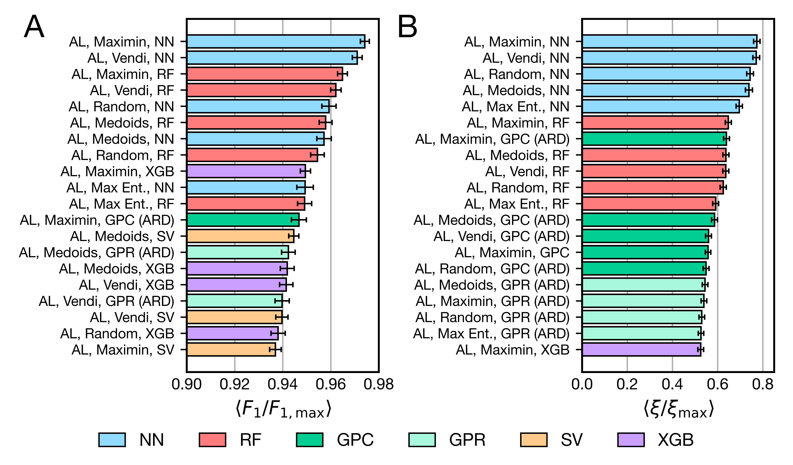

# classification-analysis

This repository contains the data and analysis scripts required to reproduce the results shown in [Data Efficiency of Classification Strategies for Chemical and Materials Design](https://doi.org/10.26434/chemrxiv-2024-1sspf).

All data required for each figure can be reproduced using the script with the appropriate name (e.g., `fig3.py` recreates the data required for Figure 3). This data is stored in the ``data/`` directory as a pickle file. To plot the appropriate figure, you can use the ``plotter.py`` file. To plot figure 3, you would call ``python plotter.py --fig 3``. This will generate a figure that is stored in the ``figures/`` directory. This process is not necessary for figures 1c and figure 2; the corresponding files will automatically generate the figure themselves. We also include the script `prep_metafeatures.py` that downselects the set of unique and uncorrelated metafeatures (stored in `metafeatures.pickle`) used in the sequential feature addition conducted in `fig8.py`.

### Data Files

`results.pickle` is a dictionary that contains the performances of all seeds of all classification strategies on all tasks. The dictionary is structured by task, algorithm type, sampler, model, and seed. Therefore, `results['qm9_cv']['al']['medoids']['nn'][24]` contains a numpy array of the performances of of the 24th seed of an active learning algorithm with a medoids sampler and neural network model applied to classification of heat capacities in QM9. The numpy array is a 2D array of shape `(11,4)` where the first axis corresponds to rounds of active learning and the second axis includes the round number, balanced accuracy, Macro F1, and Matthews Correlation Coefficient, in that order. 

`baseline/baseline.pickle` is a dictionary that contains the performance of the naive strategy used to benchmark the data efficiency of classification strategies. Keys correspond to tasks and values correspond to numpy arrays where the first axis is the number of acquired points and the second axis includes the mean minus standard error, mean, and mean plus standard error, in that order, for the Macro F1 scores of the naive strategy. `basleine/baseline.pickle` is a processed version of several `baseline/baseline_raw_*.pickle` files that contain the balanced accuracy, Macro F1 score, and Matthew Correlation Coefficient for every seed of the naive strategy on every task.

### Package Dependencies

The packages required for the analysis scripts above can be installed using the `requirements.txt` file shown. `prep_metafeatures.py` also uses code from the `ClassificationSuite` Python package that can be installed following the instructions at the [classification-suite](https://github.com/webbtheosim/classification-suite) repository.
